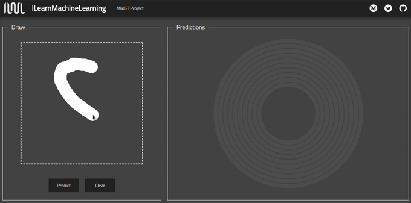

<p align="center"> 
    
</p>

<h1 align="center">ILearnMachineLearning.js</h1>

## Description

Thanks to this project I could combine my knowledge from two areas: machine learning and web development. The whole application is written in React using TypeScript and Redux, but the engine that drives it is [TensorFlow.js][1] - a modern library for training and deploying machine learning models. You can find a working app [here][2] or play with it on your computer.

``` bash
# install dependencies
npm install

# serve with hot reload at localhost:3000
npm run 
```

## MNIST

[MNIST][3] dataset is widely known in the field of machine learning. It contains about 70000 examples of handwritten digits. Photos are black and white, normalized to fit into a 28x28 pixel bounding box and anti-aliased. This iconic dataset was used to train the model in Keras and then turned into a form understandable to TensorFlow.js and used as the heart of the first project. The whole process of creating the model has been described in the [Medium][4] article.

<p align="center"> 

</p>

## Build Keras models

If you are interested in neural networks and would like to know how to create models used in this project, I encourage you to test the scripts on your computer.

``` bash
# clone repository
git clone https://github.com/SkalskiP/ILearnMachineLearning.js.git

# navigate to models directory
cd ILearnMachineLearning.js/models

# install all required packages and dependencies as well as python environment
./setup.sh

# activate python environment
source .env/bin/activate
```

## Related projects

If you're interested in machine learning, check out my other [projects][5] and check my profile on [Kaggle][6].

## Read more about In-Browser ML

1. [TensorFlow.js Tutorials & Guides][7]
2. [Introducing TensorFlow.js: Machine Learning in Javascript][8]
3. [Neural Network 3D Simulation][9]
4. [YOLO: Real-Time Object Detection][10]
5. [AI Experiments with Google][11]
6. [Gentle guide on how YOLO Object Localization works with Keras][12]
7. [How to implement a YOLO (v3) object detector from scratch in PyTorch: Part 1][13]
8. [You only look once][14]

[1]: https://github.com/tensorflow/tfjs
[2]: https://learn-machine-learning.herokuapp.com/
[3]: http://yann.lecun.com/exdb/mnist/
[4]: https://medium.com/@piotr.skalski92/my-first-tensorflow-js-project-b481bdad17fb
[5]: https://github.com/SkalskiP/ILearnMachineLearning.py
[6]: https://www.kaggle.com/skalskip
[7]: https://js.tensorflow.org/tutorials/
[8]: https://medium.com/tensorflow/introducing-tensorflow-js-machine-learning-in-javascript-bf3eab376db
[9]: https://www.youtube.com/watch?v=3JQ3hYko51Y
[10]: https://pjreddie.com/darknet/yolo/
[11]: https://experiments.withgoogle.com/collection/ai
[12]: https://heartbeat.fritz.ai/gentle-guide-on-how-yolo-object-localization-works-with-keras-part-2-65fe59ac12d
[13]: https://blog.paperspace.com/how-to-implement-a-yolo-object-detector-in-pytorch/
[14]: https://leonardoaraujosantos.gitbooks.io/artificial-inteligence/content/single-shot-detectors/yolo.html
